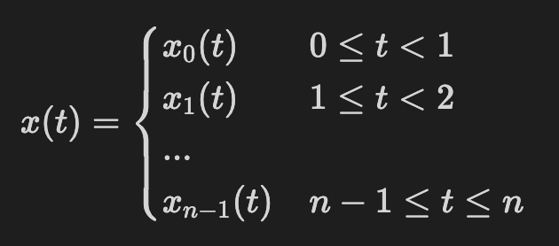
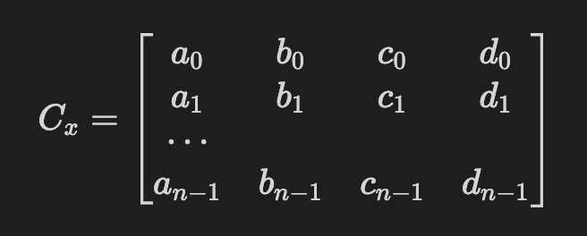
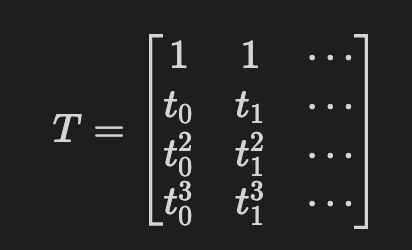

# CLI-Spline

A small CLI game using cubic spline interpolation (pronounced *klie-spline*). Make a path out of pebbles for some ants to follow!

## Build
To install and build, clone the repository and use `build.sh` (or `build-brew.sh` if using MacOS with Homebrew to install GSL):
```
$ git clone https://github.com/Athan13/cli-spline.git
$ cd cli-spline
$ bash build.sh
$ ./cli-spline.out
```

Dependencies are [ncurses](https://invisible-island.net/ncurses/announce.html) and [GSL](https://www.gnu.org/software/gsl/). `build.sh` is written for gcc.

## How To Play

First, drop the pebbles to make a path for the ants to follow:


Note that once you hit space, a pebble is dropped and a new one automatically appears under your cursor that you can move using the HJKL keys.

Once you've hit enter, watch the ants go! Tip: hit space a few times in quick succsession to get a full column of ants.

## How It Works

Once we've laid down the pebbles for the ants to follow, how do we give the ants a path that hits all the pebbles? The calculations described below are in `spline-calc.c`.

Fundamentally, we want to be able to describe the path of the ants as a function of time. If we think of the ants as a pair of $(x, y)$ coordinates in 2D space, we can do this using a pair of parametric equations $(x(t)$, $y(t))$. For example, if we set $x(t) = t$ and $y(t) = 2t + 1$, the ants will be at the position $(0, 1)$ at $t = 0$.

In order for the ants to hit every single one of the pebbles, it makes sense to make $x(t)$ and $y(t)$ piecewise: we guarantee that at $t = 0, 1, 2...$, $(x(t), y(t))$ are the coordinates of the corresponding (first, second, third, etc.) pebble, and we figure out a good function to go between each pair of pebbles. Therefore, for $n+1$ pebbles:

and likewise for $y(t)$.

We need a couple of things to make this work. Firstly, the path must be continuous. This means that $x_0(1) = x_1(1)$, $x_1(2) = x_2(2), \ ... \ x_{n-2}(n-1) = x_{n-1}(n-1)$ (and the same for the $y_i(t)$'s). Second, the path needs to actually match the location of the pebbles. This means that $(x_0(0), y_0(0))$ is the location of the first pebble, $(x_1(1), y_1(1))$ is the location of the second pebble, and so on. 

Naively, we might have the ants follow a straight line from one pebble to the next; this does meet all of our conditions. However, this has the effect of making jagged edges at the locations of the pebbles.

The way to get around this issue is to make the *derivatives* of each of the $x_i(t)$ and $y_i(t)$'s match as well. In other words, we know that $x_i(i+1) = x_{i+1}(i+1)$ and $y_i(i+1) = y_{i+1}(i+1)$, but we impose the additional condition that $x'_i(i+1) = x'_{i+1}(i+1)$ and $y'_i(i+1) = y'_{i+1}(i+1)$. The function $x_i(t)$ therefore has to meet the following conditions:
- $x_i(i)$ is the $x$-coordinate of the $i$'th pebble.
- $x_i(i+1)$ is the $x$-coordinate of the $i+1$'st pebble.
- $x_i'(i) = x'_{i - 1}(i)$. 
- $x_i'(i+1) = x'_{i + 1}(i+1)$.

Given that we have those four conditions, we can use a cubic polynomial of the form $x_i(t) = a_i + b_i(t - i) + c_i(t - i)^2 + d_i(t - i)^3$ which gives us four unknowns (the coefficients $a_i, \ b_i, \ c_i, \ d_i$). We are able to find the coefficients as follows.

The $a_i$'s are simply the $x$-coordinate of the $i$'th pebble. To find the $c_i$'s we must solve $A\textbf{x} = \textbf{b}$ for: 


where $A$ is an $n+1$ by $n+1$ matrix and $\textbf{b} \in \mathbb{R}^{n+1}$ (note that this *is not* the same $\textbf{b}$ that is used in the coefficients above). We set $c_i$ equal to the $i$'th entry of $\textbf{x}$.

Finally, we set $d_i = \frac{c_{i+1} - c_i}{3}$ and $b_i = a_{i+1} - a_i + d_i$.

We store all of these into one big coefficients matrix $C_x$:



We repeat the entire process for $y$ to get a $C_y$.

In order to actually display a curve, we need to evaluate these polynomials at a series of points. Because $x_i(t) = a_i + b_i(t - i) + c_i(t - i)^2 + d_i(t - i)^3$, this is equivalent to evaluating the polynomial $\hat{x_i}(t) = a_i + b_it + c_it^2 + d_it^3$ at a series of points between 0 and 1, call them $t_0, t_1, ...$.

We do this by constructing a matrix $T$: 



which allows us to calculate a path matrix $P_x = C_xT$ and $P_y = C_yT$. These matrices, when read in row major order, give us exactly the path that our ants will take.